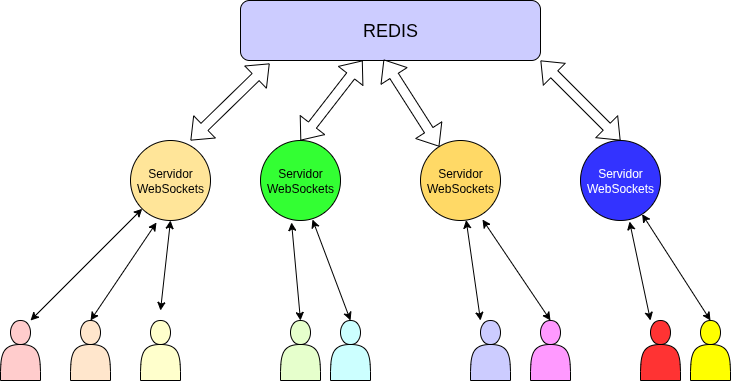

# Introdução

Durante as aulas estudamos WebSockets e vimos como é possível criaar um servidor de WebSockets que recebe conexões de clientes, insere o cliente numa lista e conta com um sistema de broadcast para enviar a mensagem recebida para os demais clientes.

Também durante as aulas vimos o **PM2**, um aplicativo que permite disparar uma aplicação node e executá-las como um cluster, ou seja, podemos lançar *n* servidores de WebSockets para receber conexões de diversos clientes. O **PM2** usa um balanceador de carga para dividir as conexões dos clientes para os diferentes processos servidores. Uma vez o cliente conectado num servidor, ele sempre envia/recebe mensagens deste/para este servidor apenas.

O problema nisso é que acabamos criando uma arquitetura onde clientes  estão  conectados  num determinado servidor e podem enviar/receber mensagens apenas de clientes conectados no mesmo servidor.

Uma forma de resolver o problema é utilizando o **REDIS**. Como visto em aula o **REDIS** pode ser utilizado como uma memória compartilhada e também como uma forma de comunicação via *publish/subscribe*.

Nesta atividade, o objetivo é modificar o código do processo servidor de WebSockets  para utilizar o REDIS e assim criar uma arquitetura distribuída que permita os clientes enviar mensagens para todos os clientes independentemente do servidor utilizado.

## Passos
Vamos por partes, primeiramente vamos disparar um servidor de WebSockets e conectar clientes nele, enviar mensagens por broadcast e ver que os demais clientes recebem a mensagem.

O segundo passo é disparar o servidor usando o **PM2** , refazer o teste e ver que não funciona mais. Perceba que quando um cliente tenta conectar no servidor ele não sabe qual servidor será escolhido, assim podem ocorrer casos em que todos os clientes estão num mesmo servidor e tudo funciona perfeitamente e vezes em que cada cliente está num servidor diferente e assim as mensagens enviadas nunca chegam. Utilize o **PM2 monit** para ver os clientes que conectaram em cada um dos servidores e assim justificar o por que as mensagens estão chegando ou não.

Finalmente vamos para o último passo e esse envolve fazer com que cada servidor faça um *subscribe* num tópico (ex: **broadcast**) . Cada vez que algum cliente envia uma mensagem por WebSocket o servidor faz um *publish* dessa mensagem e  assim todos os servidores, inclusive ele mesmo recebe a mensagem. Sempre que um servidor recebe uma mensagem no *subscribe* ele faz um broadcast para os seus clientes.

